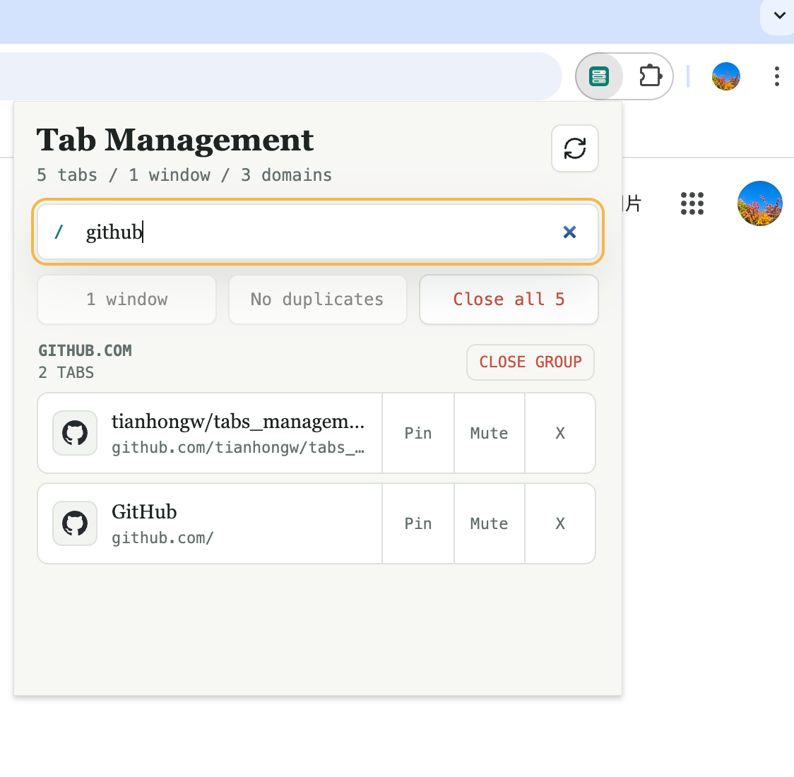

# Tab Management

Tab Management is a lightweight Chrome extension for managing tabs that are already open. It keeps the popup compact while covering the everyday tab actions: search, switch, close, pin, mute, and clean up duplicates.

## Screenshot



## Features

- List all open tabs grouped by tab domain.
- Refresh the tab list manually from the popup.
- Search tabs by title or URL.
- Press Enter in the search box to jump to the first match.
- Close every tab in a domain group.
- Click a tab to focus its window and switch to it.
- Close individual tabs.
- Close all open tabs across all Chrome windows.
- Pin or unpin individual tabs.
- Mute or unmute individual tabs.
- Close duplicate tabs by normalized exact URL, keeping the active, pinned, or current-window tab when possible.
- Treat `chrome://newtab/` tabs as duplicates; exclude other Chrome internal pages and extension pages.
- Toggle between all windows and the current window when multiple Chrome windows are open; disable that control when only one window is open.

## Install From GitHub

This extension is currently meant to be loaded as an unpacked Chrome extension.

1. Clone this repository:

   ```bash
   git clone https://github.com/tianhongw/tabs_management.git
   cd tabs_management
   ```

2. Open `chrome://extensions` in Chrome.
3. Turn on **Developer mode**.
4. Click **Load unpacked**.
5. Select the cloned repository folder.
6. Click the Tab Management icon in the Chrome toolbar.

## Files

- `manifest.json` declares the MV3 extension and `tabs` permission.
- `popup.html` defines the popup structure.
- `styles.css` handles the compact popup UI.
- `popup.js` reads and updates Chrome tabs with the `chrome.tabs` and `chrome.windows` APIs.
- `assets/` contains the README screenshot.
- `icons/` contains the extension icon source and generated PNG sizes.

## Roadmap

- Save and restore tab sessions.
- Add keyboard navigation for search results.
- Close all tabs matching the current search.
